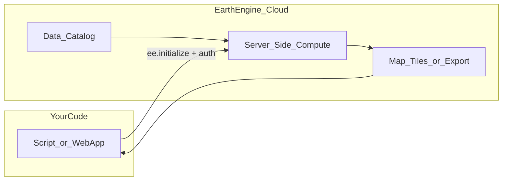

# How Earth Engine Works

Before writing scripts, it helps to understand what Earth Engine is doing behind the scenes. This mental model will make the code in the other docs feel less mysterious.

## The Big Picture

Earth Engine is a **cloud platform** that stores petabytes of satellite and scientific data and runs geospatial computations on Google's servers. Your code does not download entire datasets to your laptop — it describes *what* to compute, and Earth Engine executes it remotely.



**Your role:** build a computation graph using the JavaScript API.

**Earth Engine's role:** run that graph against catalog data and return results (numbers, metadata, or map tile URLs).

Official reference: [Client versus server](https://developers.google.com/earth-engine/guides/client_server)

## Core Data Types

### `ee.Image` — one raster snapshot

A single grid of pixels, possibly with multiple **bands** (layers). Example: one elevation map, one temperature field.

```javascript
var elevation = ee.Image('NASA/NASADEM_HGT/001').select('elevation');
```

### `ee.ImageCollection` — a time series of images

Many images stacked together, usually with a timestamp per image. Example: monthly climate data, daily satellite passes.

```javascript
var climate = ee.ImageCollection('ECMWF/ERA5_LAND/MONTHLY_AGGR')
  .filterDate('2023-01-01', '2023-02-01');
```

### `ee.Geometry` — where on Earth

Points, rectangles, polygons. Used to filter data or extract values at a location.

```javascript
var jakarta = ee.Geometry.Point([106.8, -6.2]); // [longitude, latitude]
```

Note: Earth Engine uses **longitude first**, then latitude — the opposite of how people often say "lat, lng".

### `ee.Feature` and `ee.FeatureCollection` — vector data

Points, lines, or polygons with properties (like city name). Useful when you have many locations to sample.

## The Standard Workflow

Almost every Earth Engine script follows this pattern:

```
1. Load dataset     →  ee.Image(...) or ee.ImageCollection(...)
2. Filter           →  .filterDate(), .filterBounds()
3. Select band      →  .select('temperature_2m')
4. Reduce or render →  .reduceRegion() or .getMapId()
5. Get results      →  .getInfo() or callback
```

### Example: temperature at one point

```javascript
var point = ee.Geometry.Point([106.8, -6.2]);
var image = ee.ImageCollection('ECMWF/ERA5_LAND/MONTHLY_AGGR')
  .filterDate('2023-01-01', '2023-02-01')
  .first()
  .select('temperature_2m');

var stats = image.reduceRegion({
  reducer: ee.Reducer.first(),
  geometry: point,
  scale: 10000  // meters — coarser = faster, less precise
});
```

Until you call `.getInfo()` (or pass a callback), `stats` is just a **description** of work to do — nothing has run yet.

## Deferred Execution (Why Code Feels "Lazy")

Earth Engine uses **deferred execution**. When you write:

```javascript
var doubled = image.multiply(2);
```

...nothing is computed immediately. You are building a recipe. The recipe is sent to Google's servers only when you request a result with:

| Method | What it returns | Use when |
|--------|-----------------|----------|
| `.getInfo()` | Actual values (JSON) | Point stats, small extracts |
| `.getMapId(visParams, callback)` | Map tile URL + token | Displaying a layer on a web map |
| `Export.*` | File in Cloud Storage / Drive | Large downloads |

This is why you cannot use a `for` loop to process thousands of images one-by-one on your machine — you describe the operation and let Earth Engine parallelize it.

## Code Editor vs Node.js

| Environment | Where it runs | Auth method | Best for |
|-------------|---------------|-------------|----------|
| **Code Editor** (browser) | Google's web IDE | Your Google account (OAuth) | Learning, prototyping, maps |
| **Node.js** (local/server) | Your machine or server | Service account private key | Web apps, automation, APIs |

The **JavaScript API is the same** in both environments. Code you write in the Code Editor can usually be copied into Node.js with two additions:

1. `require('@google/earthengine')`
2. Service account authentication before `ee.initialize()`

The Code Editor has extras that Node.js does **not** have: `Map.addLayer()`, `ui.Chart`, buttons, and panels. In Node.js you get data and tile URLs instead.

## Async Patterns in Node.js

In Node.js, Earth Engine calls are **asynchronous**. Use callbacks or Promises — never expect synchronous return values.

### Callback style (used in official docs)

```javascript
image.reduceRegion({...}).getInfo(function(result, error) {
  if (error) {
    console.error(error);
    return;
  }
  console.log(result);
});
```

### Promise wrapper (recommended for modern code)

See [`docs/examples/auth-init.js`](./examples/auth-init.js) for a reusable `initEarthEngine()` helper, and the examples for Promise-based `getInfo` usage.

**Important:** In Cloud Functions and production servers, avoid synchronous Earth Engine calls entirely. They block the event loop and are not supported in some environments.

## Visualization Parameters

When displaying data on a map, you pass `visParams` to tell Earth Engine how to color pixels:

```javascript
var visParams = {
  bands: ['temperature_2m'],
  min: 229,   // Kelvin — cold
  max: 304,   // Kelvin — hot
  palette: ['blue', 'yellow', 'red']
};
```

Different datasets use different units and ranges. Always check the [dataset catalog page](https://developers.google.com/earth-engine/datasets/) for band names, units, and suggested min/max values.

## Common Gotchas

1. **Lon/lat order** — `ee.Geometry.Point([lng, lat])`, not `[lat, lng]`.
2. **Scale parameter** — `reduceRegion` needs a `scale` (pixel size in meters). Too fine = slow or timeout; too coarse = inaccurate.
3. **Kelvin vs Celsius** — ERA5 temperature is in Kelvin. Subtract 273.15 for Celsius.
4. **Forecast vs observation** — GFS (`NOAA/GFS0P25`) is a *forecast* model, not measured weather. Climate datasets like ERA5 are *reanalysis* (blended model + observations).
5. **Static vs time-series** — `ee.Image('NASA/NASADEM_HGT/001')` has no date filter; `ee.ImageCollection(...)` usually needs `.filterDate()`.
6. **Never put private keys in the browser** — `authenticateViaPrivateKey` only works in Node.js. Web frontends must call your backend API instead.

## What's Next

- **[Climate, weather & geophysical scripts](./02-scripts-climate-weather-geophysical.md)** — hands-on examples for each data category
- **[Node.js web app integration](./03-nodejs-webapp-integration.md)** — expose the same data through a local API
