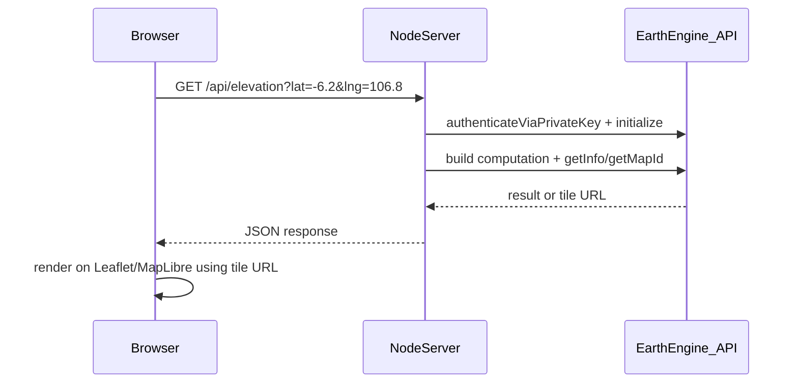

# Node.js Web App Integration

How to expose Earth Engine data through a local Node.js web application. This guide covers architecture and code patterns — not a full app scaffold.

For working script examples, see [02 — Climate, Weather & Geophysical Scripts](./02-scripts-climate-weather-geophysical.md).

## Architecture Overview

Earth Engine credentials must stay on the server. Your browser never talks to Earth Engine directly.



**Why a backend proxy?**

- Service account private keys cannot run in the browser (`authenticateViaPrivateKey` throws a security error in client-side code).
- You control rate limits, input validation, and which datasets users can access.
- Users of your app do not need their own Earth Engine account.

See [ADR-001](./decisions/ADR-001-earth-engine-nodejs-auth.md) for the full auth decision rationale.

## Installation

```bash
npm install @google/earthengine express
```

Official reference: [NPM Installation](https://developers.google.com/earth-engine/guides/npm_install)

## Server Startup: Initialize Once

Authenticate and initialize Earth Engine **once** when the server starts, not on every request.

```javascript
const express = require('express');
const { initEarthEngine } = require('./docs/examples/auth-init');

const app = express();
const PORT = process.env.PORT || 3000;

async function start() {
  await initEarthEngine();
  console.log('Earth Engine initialized');

  app.listen(PORT, () => {
    console.log(`Server listening on http://localhost:${PORT}`);
  });
}

start().catch((err) => {
  console.error('Failed to start:', err);
  process.exit(1);
});
```

Reuse the same `ee` session across all API routes. The auth token refreshes automatically.

## Two API Patterns

### Pattern A: Point / Region Stats → JSON

Use when the frontend needs a number (temperature, elevation, land cover class).

```javascript
const { ee, getInfo } = require('./docs/examples/auth-init');

app.get('/api/geophysical/elevation', async (req, res) => {
  try {
    const lat = parseFloat(req.query.lat);
    const lng = parseFloat(req.query.lng);

    if (isNaN(lat) || isNaN(lng) || lat < -90 || lat > 90 || lng < -180 || lng > 180) {
      return res.status(400).json({ success: false, error: 'Invalid lat/lng' });
    }

    const point = ee.Geometry.Point([lng, lat]);
    const image = ee.Image('NASA/NASADEM_HGT/001').select('elevation');

    const stats = await getInfo(
      image.reduceRegion({
        reducer: ee.Reducer.first(),
        geometry: point,
        scale: 30,
      })
    );

    res.json({
      success: true,
      data: { elevation_m: Math.round(stats.elevation) },
      error: null,
    });
  } catch (err) {
    res.status(500).json({ success: false, data: null, error: err.message });
  }
});
```

### Pattern B: Map Tiles → Tile URL

Use when the frontend needs to display a raster layer on a map.

```javascript
const { ee, getMapId } = require('./docs/examples/auth-init');

app.get('/api/climate/temperature-map', async (req, res) => {
  try {
    const image = ee
      .ImageCollection('ECMWF/ERA5_LAND/MONTHLY_AGGR')
      .filterDate('2023-01-01', '2023-02-01')
      .first()
      .select('temperature_2m');

    const visParams = {
      bands: ['temperature_2m'],
      min: 229,
      max: 304,
      palette: ['#000004', '#410967', '#932567', '#f16e43', '#fcffa4'],
    };

    const mapTile = await getMapId(image, visParams);

    res.json({
      success: true,
      data: {
        mapid: mapTile.mapid,
        token: mapTile.token,
        urlFormat: mapTile.urlFormat,
      },
      error: null,
    });
  } catch (err) {
    res.status(500).json({ success: false, data: null, error: err.message });
  }
});
```

The frontend uses `urlFormat` to request tiles. Earth Engine returns URLs like:

```
https://earthengine.googleapis.com/v1/projects/earthengine-legacy/maps/{mapid}/tiles/{z}/{x}/{y}?token={token}
```

## Suggested API Routes

| Route | Params | Returns | Dataset |
|-------|--------|---------|---------|
| `GET /api/climate/temperature` | `lat`, `lng`, `month` (YYYY-MM) | Temperature in °C | ERA5-Land |
| `GET /api/climate/temperature-map` | `month` | Map tile URL | ERA5-Land |
| `GET /api/weather/precipitation` | `west`, `south`, `east`, `north` | Mean precip + tile URL | GFS |
| `GET /api/geophysical/elevation` | `lat`, `lng` | Elevation in meters | NASADEM |
| `GET /api/geophysical/landcover` | `lat`, `lng` | Land cover class ID + label | WorldCover |

### Climate temperature endpoint (full example)

```javascript
app.get('/api/climate/temperature', async (req, res) => {
  try {
    const lat = parseFloat(req.query.lat);
    const lng = parseFloat(req.query.lng);
    const month = req.query.month || '2023-01';

    if (isNaN(lat) || isNaN(lng)) {
      return res.status(400).json({ success: false, error: 'lat and lng required' });
    }

    const [year, mon] = month.split('-');
    const startDate = `${year}-${mon}-01`;
    const endMonth = parseInt(mon, 10) + 1;
    const endDate =
      endMonth > 12
        ? `${parseInt(year, 10) + 1}-01-01`
        : `${year}-${String(endMonth).padStart(2, '0')}-01`;

    const point = ee.Geometry.Point([lng, lat]);
    const image = ee
      .ImageCollection('ECMWF/ERA5_LAND/MONTHLY_AGGR')
      .filterDate(startDate, endDate)
      .first()
      .select('temperature_2m');

    const stats = await getInfo(
      image.reduceRegion({
        reducer: ee.Reducer.first(),
        geometry: point,
        scale: 10000,
      })
    );

    const tempC = stats.temperature_2m - 273.15;

    res.json({
      success: true,
      data: { month, temperature_c: Math.round(tempC * 100) / 100 },
      error: null,
    });
  } catch (err) {
    res.status(500).json({ success: false, data: null, error: err.message });
  }
});
```

## Frontend: Displaying Map Tiles

Once your API returns `urlFormat` and `token`, add the layer to a map library.

### Leaflet example

```html
<div id="map" style="height: 500px;"></div>
<script src="https://unpkg.com/leaflet@1.9.4/dist/leaflet.js"></script>
<link rel="stylesheet" href="https://unpkg.com/leaflet@1.9.4/dist/leaflet.css" />
<script>
  const map = L.map('map').setView([-6.2, 106.8], 5);
  L.tileLayer('https://{s}.tile.openstreetmap.org/{z}/{x}/{y}.png').addTo(map);

  fetch('/api/climate/temperature-map?month=2023-01')
    .then((r) => r.json())
    .then(({ data }) => {
      const url =
        data.urlFormat.replace('{z}', '{z}').replace('{x}', '{x}').replace('{y}', '{y}') +
        '&token=' +
        data.token;

      L.tileLayer(url, { opacity: 0.7 }).addTo(map);
    });
</script>
```

### Google Maps overlay

Use `google.maps.ImageMapType` with the same tile URL pattern. The `urlFormat` from Earth Engine is compatible with standard `{z}/{x}/{y}` tile schemes.

## Security Checklist

Before deploying beyond localhost:

- [ ] **Private key** stored in environment variable or secret manager — never in source code or git
- [ ] **`.gitignore`** excludes `.env`, `*-key.json`, `credentials/`
- [ ] **Input validation** on all `lat`, `lng`, `bbox`, and date parameters
- [ ] **Rate limiting** on API routes (Earth Engine has usage quotas)
- [ ] **CORS** configured if frontend is on a different origin
- [ ] **No `authenticateViaPrivateKey`** in any client-side bundle (webpack, Vite, etc.)
- [ ] **Error messages** do not leak key paths or internal project details

## Common Pitfalls

### 1. Async-only in Node.js

Earth Engine does not support synchronous API calls in Node.js or Cloud Functions. Always use callbacks or Promises (`getInfo`, `getMapId`).

### 2. Network / firewall errors

```
Error: Failed to contact Earth Engine servers
```

Check firewall, VPN, or proxy settings. Some networks block Google APIs. Test with `curl https://earthengine.googleapis.com`.

### 3. Quota limits

Noncommercial projects use the [Community Tier](https://developers.google.com/earth-engine/guides/noncommercial_tiers) by default. Heavy `reduceRegion` calls over large areas can hit compute limits. Use coarser `scale` values or smaller geometries.

### 4. `getMap` is deprecated

Use `getMapId(visParams, callback)` instead of `getMap()`. The returned object includes `mapid`, `token`, and `urlFormat`.

### 5. GFS date filters return empty collections

GFS updates every 6 hours. If your date filter is too narrow or uses future dates, `.first()` may fail. Widen the window to the last 2–3 days.

### 6. Kelvin vs Celsius

ERA5 `temperature_2m` is in Kelvin. Always convert before showing to users: `tempC = tempK - 273.15`.

## Environment Setup for Local Development

```bash
# .env (do not commit)
GEE_CLOUD_PROJECT=your-gcp-project-id
GEE_SERVICE_ACCOUNT_KEY_PATH=./credentials/service-account-key.json
PORT=3000
```

Load with `dotenv` if desired:

```bash
npm install dotenv
```

```javascript
require('dotenv').config();
```

## Project Structure (suggested)

When you are ready to build the app:

```
your-app/
├── credentials/           # gitignored — service account JSON
├── src/
│   ├── server.js          # Express app + EE init
│   ├── routes/
│   │   ├── climate.js
│   │   ├── weather.js
│   │   └── geophysical.js
│   └── ee/
│       └── auth-init.js   # copy from docs/examples/
├── public/
│   └── index.html         # map frontend
├── .env                   # gitignored
├── .env.example           # committed — documents required vars
└── package.json
```

## What's Next

- Run the [example scripts](./examples/) to verify your credentials work
- Start with one endpoint (`/api/geophysical/elevation`) and expand from there
- Browse the [Data Catalog](https://developers.google.com/earth-engine/datasets/) for additional layers relevant to GeoSafe place intelligence
